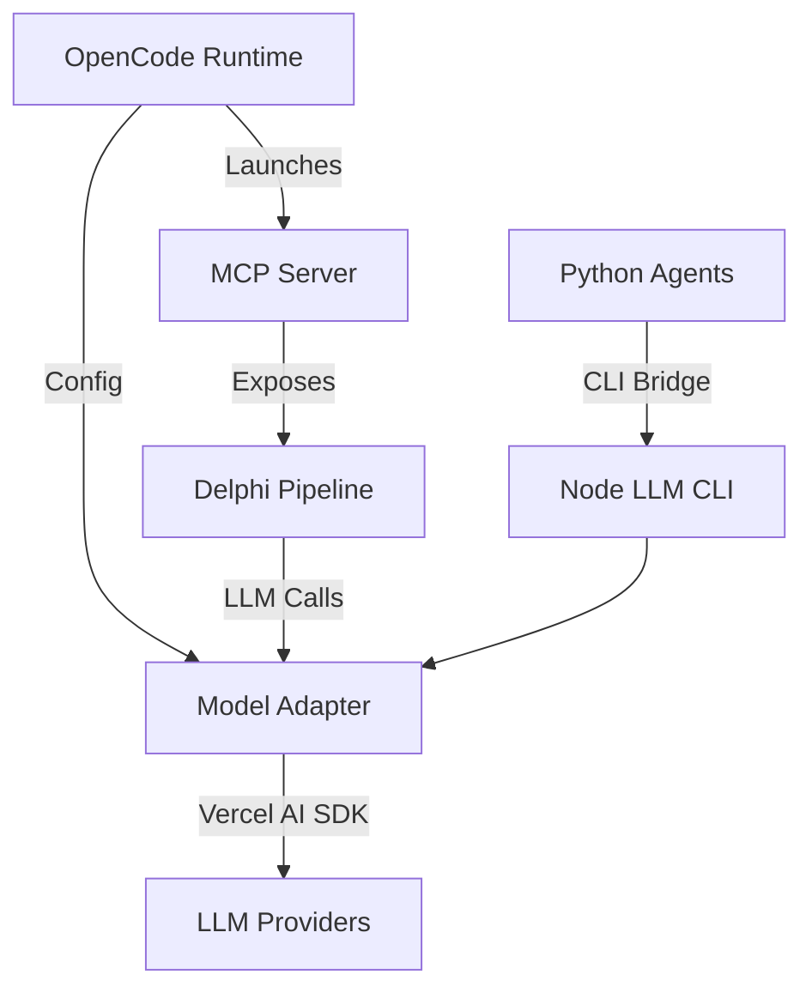

# Delphi × OpenCode Integration

## Overview

This document describes the integration between Delphi's automated development pipeline and OpenCode, enabling Delphi to consume any LLMs configured in OpenCode without requiring additional API keys or configuration.

## Architecture



## Components

### 1. Model Adapter (`src/llm/index.ts`)

Wraps Vercel AI SDK to provide unified LLM interface:

```typescript
interface LLMAdapter {
  chat(options: {
    messages: Message[]
    useSmall?: boolean
    maxTokens?: number
  }): Promise<string>
}
```

### 2. Python Agent Shims (`src/llm/cli.ts`)

Node.js CLI that bridges Python agents to the LLM adapter:

```bash
node llm/cli.js '{"messages":[...], "useSmall":true}'
```

### 3. MCP Server (`delphi-mcp.ts`)

Exposes Delphi pipeline as an MCP tool:

```typescript
server.tool('delphi.run', {
  description: 'Run Delphi automated development pipeline',
  parameters: {
    goal: { type: 'string', required: true }
  },
  handler: async ({ goal }) => {
    const diff = await runDelphi(goal)
    return { diff }
  }
})
```

### 4. OpenCode Configuration

```json
{
  "mcp": {
    "delphi": {
      "type": "local",
      "command": ["npx", "tsx", "delphi-mcp.ts"],
      "enabled": true
    }
  },
  "model": "openai/gpt-4o-mini",
  "small_model": "openai/gpt-3.5-turbo"
}
```

## Implementation Tasks

| # | Task | Component | Status |
|---|------|-----------|--------|
| 1 | Model Adapter | `src/llm/index.ts` | ⏳ |
| 2 | Python Shims | `src/llm/cli.ts` | ⏳ |
| 3 | MCP Server | `delphi-mcp.ts` | ⏳ |
| 4 | Update Python Agents | `python/*.py` | ⏳ |
| 5 | Config Documentation | `README.md` | ⏳ |
| 6 | Fallback Models | `src/llm/index.ts` | ⏳ |
| 7 | Error Handling | `src/utils/retry.ts` | ✅ |
| 8 | Telemetry | `src/utils/tracing.ts` | ✅ |

## Usage

### Via OpenCode CLI

```bash
opencode run delphi.run '{"goal": "Add logging to all API endpoints"}'
```

### Via OpenCode TUI

1. Launch OpenCode TUI
2. Select "Tools" → "Delphi"
3. Enter goal description
4. Review generated diff

### Programmatic Access

```typescript
import { OpenCodeClient } from '@opencode/sdk'

const client = new OpenCodeClient()
const result = await client.tools.run('delphi.run', {
  goal: 'Refactor callbacks to async/await'
})
console.log(result.diff)
```

## Error Handling

### Retry Strategy

- Exponential backoff: 2s → 4s → 8s → 16s
- Max attempts: 4
- Retry on: 429, 500, 502, 503, 504
- Circuit breaker: Opens after 60% failures in 10-call window

### Timeout Configuration

- LLM call timeout: 45s
- Pipeline timeout: 5 minutes
- Test execution timeout: 2 minutes

## Security

### Process Isolation

- Subprocess execution in repo directory only
- Environment variable sanitization
- No access to parent process environment
- Chroot-style restrictions

### Resource Limits

- Max diff size: 10MB
- Max memory per process: 2GB
- CPU limit: 1 core per subprocess

## Telemetry

### OpenTelemetry Spans

```
delphi.pipeline
├── delphi.planner
│   └── llm.chat (model=gpt-4o-mini)
├── delphi.refiner
│   └── llm.chat (model=gpt-3.5-turbo)
├── delphi.code_generation
│   └── claude.execute
├── delphi.test_runner
└── delphi.reviewer
    └── llm.chat (model=gpt-4o-mini)
```

### Metrics

- `delphi_pipeline_duration_ms` - Total pipeline execution time
- `delphi_llm_calls_total` - Number of LLM calls
- `delphi_llm_tokens_used` - Token consumption
- `delphi_circuit_breaker_state` - Circuit breaker status

## Testing

### Unit Tests

```bash
npm test -- src/llm
```

### Integration Tests

```bash
npm run test:integration
```

### E2E Tests

```bash
# Test with OpenAI
OPENCODE_MODEL=openai/gpt-4o npm run test:e2e

# Test with Ollama
OPENCODE_MODEL=ollama/llama3 npm run test:e2e
```

## Migration Guide

### From Standalone Delphi

1. Remove API key environment variables:
   ```bash
   unset OPENAI_API_KEY
   unset ANTHROPIC_API_KEY
   ```

2. Configure OpenCode:
   ```json
   {
     "model": "your-preferred-model",
     "small_model": "your-cheap-model"
   }
   ```

3. Launch via OpenCode:
   ```bash
   opencode run delphi.run '{"goal": "..."}'
   ```

### From Direct API Usage

Replace:
```python
import openai
response = openai.ChatCompletion.create(...)
```

With:
```python
import subprocess
import json

result = subprocess.run(
    ['node', 'llm/cli.js'],
    input=json.dumps({"messages": [...]}),
    capture_output=True,
    text=True
)
response = json.loads(result.stdout)
```

## Troubleshooting

### Common Issues

1. **Model not configured**
   - Error: `No model configured in OpenCode`
   - Fix: Add `model` to `.opencode/opencode.json`

2. **Circuit breaker open**
   - Error: `Circuit breaker is OPEN`
   - Fix: Wait 60s for reset or check LLM provider status

3. **Timeout errors**
   - Error: `LLM call timed out after 45s`
   - Fix: Use smaller model or increase timeout

4. **Memory limits**
   - Error: `Process exceeded memory limit`
   - Fix: Reduce batch size or use streaming

## Development

### Local Setup

```bash
# Install dependencies
npm install

# Build TypeScript
npm run build

# Run tests
npm test

# Start MCP server locally
npx tsx delphi-mcp.ts
```

### Debugging

Enable debug logging:
```bash
DEBUG=delphi:* opencode run delphi.run '{"goal": "test"}'
```

View telemetry:
```bash
OTEL_ENABLED=true OTEL_CONSOLE_EXPORT=true npm start
```

## Roadmap

- [ ] Streaming diff output
- [ ] Multi-model ensemble voting
- [ ] Cost tracking and budgets
- [ ] Async job queue support
- [ ] Web UI integration
- [ ] Batch processing mode

## Support

- GitHub Issues: [delphi/issues](https://github.com/org/delphi/issues)
- Documentation: [docs.delphi.dev](https://docs.delphi.dev)
- Discord: [discord.gg/delphi](https://discord.gg/delphi)