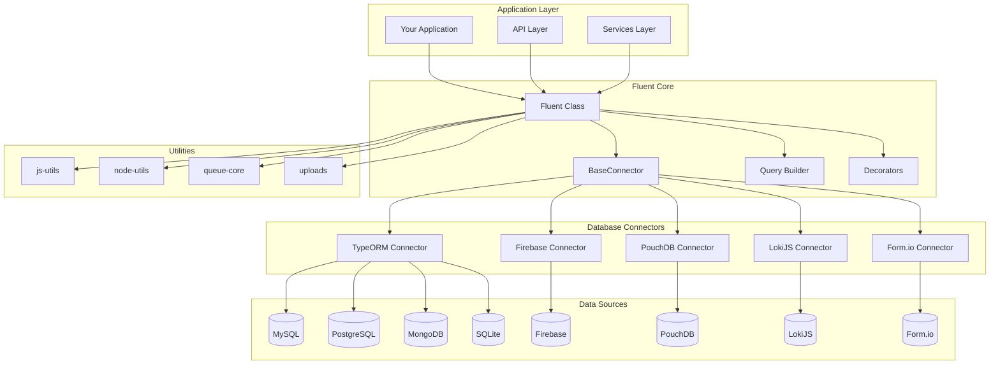
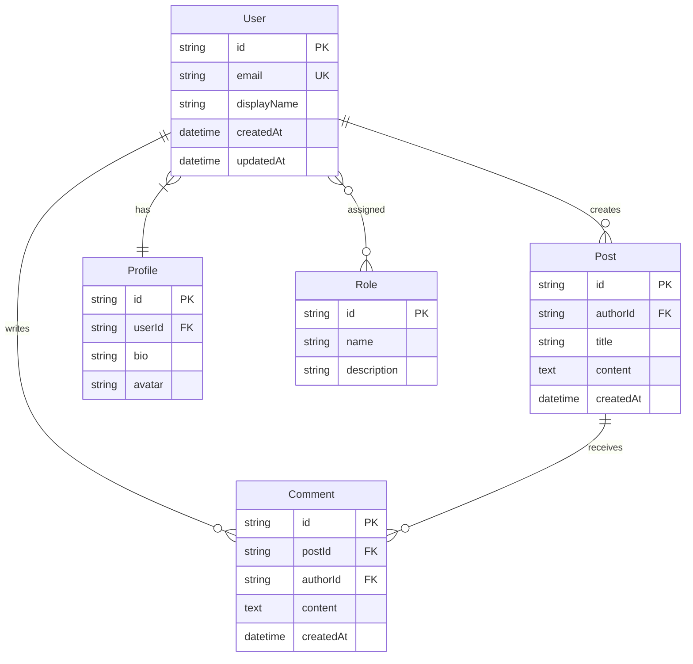
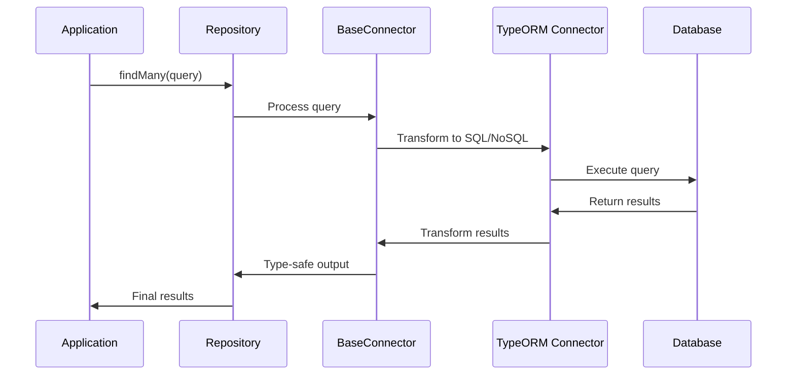

# Architecture Overview

## System Design Philosophy

Fluent is built on three core architectural principles:

1. **Database Abstraction**: Unified interface across different database systems
2. **Type Safety**: End-to-end type safety from schema to queries
3. **Extensibility**: Modular architecture with pluggable connectors

## High-Level Architecture



## Core Components

### Fluent Class (@goatlab/fluent)

The main entry point providing static utility methods and initialization.

**Key Responsibilities:**

- Database initialization and connection management
- Collection utilities for data manipulation
- Static helper methods for common operations
- Type-safe interfaces for all operations

**Technology Stack:**

- **Runtime**: Node.js 18+ with TypeScript
- **ORM**: TypeORM for SQL databases
- **Validation**: Zod for schema validation
- **Caching**: Built-in caching with js-utils
- **Utilities**: Comprehensive utility functions

### BaseConnector (@goatlab/fluent)

Abstract base class providing the foundation for all database connectors.

**Key Features:**

- Common query methods (findMany, findById, insert, update)
- Relationship handling (hasMany, belongsTo, belongsToMany)
- Type-safe query building
- Data validation and transformation
- Collection operations and utilities

### TypeORM Connector (@goatlab/fluent)

Primary connector for SQL and NoSQL databases via TypeORM.

**Supported Databases:**

- MySQL, PostgreSQL, SQLite (SQL)
- MongoDB (NoSQL with aggregation)
- In-memory databases for testing
- Connection pooling and optimization

### Database Connectors

Specialized connectors for specific database systems:

- **Firebase Connector**: Firestore integration
- **PouchDB Connector**: Local and remote CouchDB
- **LokiJS Connector**: In-memory JavaScript database
- **Form.io Connector**: Form.io API integration

## Connector Architecture

### Base Connector Pattern

All database connectors extend the BaseConnector class:

```typescript
// Base connector implementation
export abstract class BaseConnector<ModelDTO, InputDTO, OutputDTO> {
  protected outputKeys: string[]
  protected modelRelations: any
  public isMongoDB: boolean
  
  // Core query methods
  public async findMany<T extends FluentQuery<ModelDTO>>(
    query?: T
  ): Promise<QueryOutput<T, ModelDTO>[]>
  
  public async findById<T extends FindByIdFilter<ModelDTO>>(
    id: string,
    q?: T
  ): Promise<QueryOutput<T, ModelDTO> | null>
  
  public async insert(data: InputDTO): Promise<OutputDTO>
  public async updateById(id: string, data: InputDTO): Promise<OutputDTO>
  
  // Relationship methods
  protected hasMany<T>(r: T): InstanceType<T['repository']>
  protected belongsTo<T>(r: T): InstanceType<T['repository']>
  protected belongsToMany<T>(r: T): InstanceType<T['repository']>
}
```

### Connector Implementations

1. **TypeORM Connector**
   - Handles multiple database types
   - Automatic query optimization
   - Relationship management
   - Schema validation

2. **Firebase Connector**
   - Firestore document operations
   - Real-time subscriptions
   - Authentication integration
   - Offline support

3. **PouchDB Connector**
   - Local and remote sync
   - Conflict resolution
   - Offline-first approach
   - Cross-platform support

4. **Form.io Connector**
   - Dynamic form handling
   - Validation integration
   - Submission processing
   - Schema generation

## Data Architecture

### Entity Definition

Fluent uses decorators to define database entities:

```typescript
@f.entity('users')
export class User {
  @f.id()
  id: string

  @f.property({ required: true })
  email: string

  @f.property()
  displayName: string

  @f.created()
  createdAt: Date

  @f.updated()
  updatedAt: Date

  @f.hasMany({ entity: () => Post, inverse: 'author' })
  posts: Post[]

  @f.belongsToMany({
    entity: () => Role,
    joinTableName: 'user_roles',
    foreignKey: 'userId',
    inverseForeignKey: 'roleId'
  })
  roles: Role[]
}
```

### Relationship Types



### Caching Strategy

```
Level 1: In-Memory Cache (js-utils Cache)
├── Hot data (< 5 minutes)
├── Method-level caching
└── Request-scoped

Level 2: Connection Pool Cache
├── Database connections
├── Prepared statements
└── Query result caching

Level 3: Database
├── Persistent storage
├── Source of truth
└── Optimized queries with indexes
```

## API Design

### Repository Pattern

Fluent uses the repository pattern for data access:

```typescript
// Repository class extending TypeORM connector
export class UserRepository extends TypeOrmConnector<User, CreateUserDTO, UserDTO> {
  constructor(dataSource: DataSource) {
    super({
      entity: User,
      dataSource,
      inputSchema: CreateUserSchema,
      outputSchema: UserSchema
    })
  }

  // Custom business logic methods
  async findByEmail(email: string): Promise<User | null> {
    return await this.findFirst({ where: { email } })
  }

  async findActiveUsers(): Promise<User[]> {
    return await this.findMany({ 
      where: { isActive: true },
      include: { posts: true, roles: true }
    })
  }

  // Relationship methods
  posts() {
    return this.hasMany({ 
      repository: PostRepository,
      entity: () => Post 
    })
  }

  roles() {
    return this.belongsToMany({
      repository: RoleRepository,
      entity: () => Role,
      pivot: UserRoleRepository
    })
  }
}
```

### Type-Safe Queries

All queries are fully type-safe:

```typescript
// Type-safe query building
const users = await userRepo.findMany({
  select: {
    id: true,
    email: true,
    posts: {
      title: true,
      createdAt: true
    }
  },
  where: {
    isActive: true,
    posts: {
      createdAt: {
        gte: new Date('2024-01-01')
      }
    }
  },
  orderBy: [{ createdAt: 'desc' }],
  limit: 10
})
```

## Query Architecture

### Query Building Process



### Query Transformation

Fluent transforms high-level queries into database-specific operations:

```typescript
// High-level Fluent query
const query = {
  select: { id: true, name: true, posts: { title: true } },
  where: { isActive: true },
  orderBy: [{ createdAt: 'desc' }],
  limit: 10
}

// Transformed to TypeORM (SQL)
const sqlQuery = repository
  .createQueryBuilder('user')
  .select(['user.id', 'user.name', 'posts.title'])
  .leftJoinAndSelect('user.posts', 'posts')
  .where('user.isActive = :isActive', { isActive: true })
  .orderBy('user.createdAt', 'DESC')
  .limit(10)

// Transformed to MongoDB aggregation
const mongoQuery = [
  { $match: { isActive: true } },
  { $lookup: { from: 'posts', localField: '_id', foreignField: 'authorId', as: 'posts' } },
  { $project: { id: 1, name: 1, 'posts.title': 1 } },
  { $sort: { createdAt: -1 } },
  { $limit: 10 }
]
```

## Security Architecture

### Input Validation

All inputs are validated using Zod schemas:

```typescript
// Input validation schema
const CreateUserSchema = z.object({
  email: z.string().email(),
  name: z.string().min(1).max(255),
  password: z.string().min(8),
  roles: z.array(z.string()).optional()
})

// Automatic validation in connector
export class UserRepository extends TypeOrmConnector<User, CreateUserDTO, UserDTO> {
  constructor(dataSource: DataSource) {
    super({
      entity: User,
      dataSource,
      inputSchema: CreateUserSchema, // Validates all inputs
      outputSchema: UserSchema       // Validates all outputs
    })
  }
}
```

### SQL Injection Prevention

- Parameterized queries via TypeORM
- Input sanitization and validation
- Type-safe query building
- Prepared statement caching

## Performance Considerations

### Optimization Strategies

1. **Database Performance**
   - Composite indexes for common queries
   - Query result pagination with limit/offset
   - Connection pooling via TypeORM
   - Optimized relationship loading

2. **Caching Effectiveness**
   - Method-level caching with @Memo decorator
   - Connection and metadata caching
   - Query result caching
   - Cache invalidation strategies

3. **Query Performance**
   - Automatic query optimization
   - Eager vs lazy loading strategies
   - Batch operations for bulk inserts
   - Efficient relationship handling

4. **Memory Management**
   - Streaming for large datasets
   - Pagination for large result sets
   - Connection pool management
   - Garbage collection optimization

## Development Architecture

### Testing Strategy

Fluent provides comprehensive testing utilities:

```typescript
// Test setup with in-memory database
const testDataSource = new DataSource({
  type: 'sqlite',
  database: ':memory:',
  entities: [User, Post, Comment],
  synchronize: true
})

// Test repository
const userRepo = new UserRepository(testDataSource)

// Test with mock data
describe('UserRepository', () => {
  it('should find users by email', async () => {
    const user = await userRepo.insert({
      email: 'test@example.com',
      name: 'Test User'
    })
    
    const found = await userRepo.findByEmail('test@example.com')
    expect(found).toBeDefined()
    expect(found?.email).toBe('test@example.com')
  })
})
```

### Development Workflow

1. **Entity Definition**: Define entities with decorators
2. **Repository Creation**: Extend connectors for custom logic
3. **Schema Validation**: Define Zod schemas for type safety
4. **Testing**: Write comprehensive tests with utilities
5. **Migration**: Version control database changes

## Integration Patterns

### Multi-Database Applications

Fluent supports applications using multiple databases:

```typescript
// Different databases for different purposes
const userRepo = new UserRepository(postgresDataSource)
const sessionRepo = new SessionRepository(redisDataSource)
const analyticsRepo = new AnalyticsRepository(mongoDataSource)

// Consistent API across all databases
const user = await userRepo.findById('123')
const session = await sessionRepo.findById('session_456')
const analytics = await analyticsRepo.findMany({ 
  where: { userId: '123' } 
})
```

### Microservices Integration

- Shared entity definitions across services
- Consistent query patterns
- Service-specific database connections
- Cross-service data consistency

## Next Steps

- **[Installation Guide](installation.md)**: Set up your development environment
- **[Quick Start Guide](quick-start.md)**: Build your first application
- **[Core Package Documentation](../core/fluent-class.md)**: Learn the main APIs
- **[TypeORM Connector Guide](../core/typeorm-connector.md)**: Database integration
